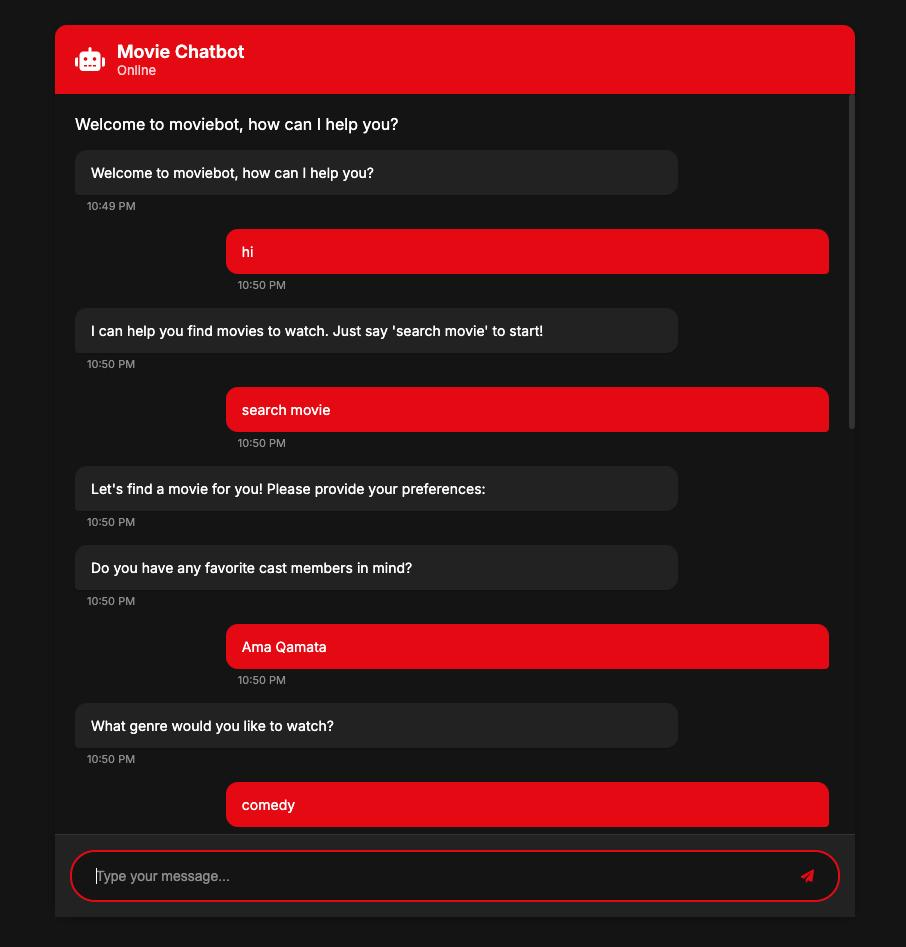

# Netflix-Movie-Recommendation
Provided content-based recommendations through a chatbot by identifying and responding to users' key interests.
# Netflix Movie Recommendation Chatbot 🎬🤖

A content-based recommendation system that suggests Netflix movies to users via an interactive chatbot interface. Users can receive personalized suggestions based on cast, genre, and keywords.

---

## Demo

---

## Features

- **Data Cleaning and Preprocessing**:  
  Handled missing values, outliers, and standardized fields using Python (Pandas, NumPy).

- **Content-Based Recommendation Model**:  
  Built with TF-IDF vectorization and cosine similarity to match users' preferences.

- **Real-Time Interaction**:  
  Deployed a chatbot using Flask Web API to provide movie suggestions instantly.

- **Data Visualization**:  
  Utilized Matplotlib and Seaborn for analyzing movie trends and data distribution.

- **Frontend UI**:  
  Simple and modern chat interface styled with HTML, CSS, and JavaScript.

---I built a movie recommendation chatbot that helps users find films they might like. First, I cleaned and organized the movie data to make sure it was accurate and easy to work with. Then, I created a system that compares movie descriptions to suggest similar titles based on what the user likes. I used a simple web chatbot so users can get real-time suggestions by just typing a message. I also analyzed and visualized movie trends to better understand what’s popular, and designed the chat interface to be clean and easy to use.
